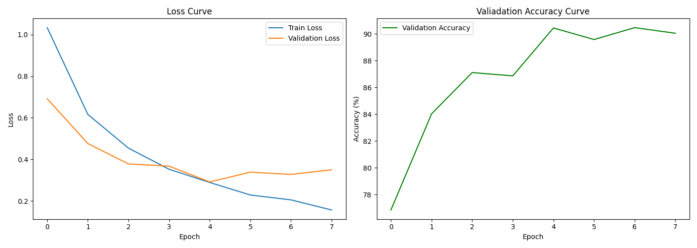
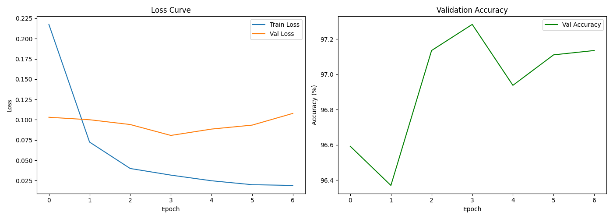

# EuroSAT Land Cover Classification

CNN classifier for satellite image land cover classification built from scratch in PyTorch, achieving **90% test accuracy** across 10 classes.

## Overview

A custom 3-block CNN trained on the EuroSAT satellite imagery dataset to classify land cover types. Implements early stopping, dataset-specific normalization, and proper train/val/test evaluation.

## Dataset

[EuroSAT](https://github.com/phelber/EuroSAT) — Sentinel-2 satellite imagery dataset
- 27,000 labeled images across 10 land cover classes
- 64×64 pixel RGB patches

## Classes
AnnualCrop, Forest, HerbaceousVegetation, Highway, Industrial, Pasture, PermanentCrop, Residential, River, SeaLake

## Architecture
Input (3 × 64 × 64)
↓
Conv2d(3→32) + ReLU + MaxPool → 32×32
↓
Conv2d(32→64) + ReLU + MaxPool → 16×16
↓
Conv2d(64→128) + ReLU + MaxPool → 8×8
↓
Flatten → Linear(8192→256) → ReLU → Dropout(0.5)
↓
Linear(256→10) → class scores

## Results

- **Test Accuracy: 90.07%**
- Early stopping triggered at epoch 8 (best model at epoch 5)
- Dataset-specific normalization calculated from training data



## Requirements

```bash
pip install torch torchvision matplotlib numpy
```

## Usage

```bash
git clone https://github.com/margaretjohn14-alt/Eurosat-cnn-classifier
cd Eurosat-cnn-classifier
python eurosat_classifier_main.py
```

Set `TRAIN = True` in the script to retrain, `TRAIN = False` to load saved model.

## Dataset Split

| Split | Size |
|---|---|
| Train | 18,900 (70%) |
| Validation | 4,050 (15%) |
| Test | 4,050 (15%) |

---

## Model 1: Custom CNN

Built a 3-block CNN from scratch without any pretrained weights.

### Architecture
```
Input (3 × 64 × 64)
        ↓
Conv2d(3→32) + ReLU + MaxPool → 32×32
        ↓
Conv2d(32→64) + ReLU + MaxPool → 16×16
        ↓
Conv2d(64→128) + ReLU + MaxPool → 8×8
        ↓
Flatten → Linear(8192→256) → ReLU → Dropout(0.5)
        ↓
Linear(256→10) → class scores
```

### Training Details
- Optimizer: Adam (lr=1e-3)
- Loss: CrossEntropyLoss
- Early stopping: patience=3
- Dataset-specific normalization calculated from training data


---

## Model 2: ResNet18 Transfer Learning

Fine-tuned a pretrained ResNet18 by unfreezing the last two convolutional blocks (layer3 and layer4) while keeping early layers frozen.

### Transfer Learning Strategy
- Early layers frozen — preserve ImageNet edge/texture features
- layer3 and layer4 unfrozen — adapt to satellite imagery patterns
- Final layer replaced: 1000 ImageNet classes → 10 land cover classes
- Trainable parameters: 10,498,570 out of 11,181,642

### Training Details
- Input size: 224×224 (ResNet native resolution)
- Optimizer: Adam (lr=1e-4)
- Loss: CrossEntropyLoss
- Early stopping: patience=3



---

## Key Findings

- ResNet18 with partial unfreezing outperforms frozen transfer learning by ~4%
- Custom CNN achieves competitive 90% accuracy with far fewer parameters
- Dataset-specific normalization improves over ImageNet defaults for satellite data
- Early stopping prevented overfitting in all experiments

---

## Requirements

```bash
pip install torch torchvision matplotlib numpy
```

## Usage

```bash
git clone https://github.com/margaretjohn14-alt/Eurosat-cnn-classifier
cd Eurosat-cnn-classifier
```

Train and evaluate custom CNN:
```bash
python eurosat_classifier_main.py  # set TRAIN=True to retrain
```

Train and evaluate ResNet18:
```bash
python resnet_classifier.py  # set TRAIN=True to retrain
```